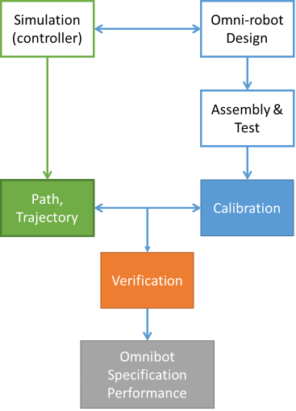

# Omnibot
Design a controller for a four-wheel Omni-directional robot and verify it on a prototype. 

## Objective: 
Learning how to design the controller for an omnidirectional robot and implement it on a prototype regarding the simulation model. 

## Tasks description:
 1. Robot Controller Design: Use Matlab Robot Simulation (Mobile Robot Modeling)
 2. Omni-directional Robot Design: create 3D models with the bill of material
 3. Build the prototype: assembly and test the prototype
 4. Test and verification: Apply the controller on the prototype and calibrate its configuration (write a test report)
Documentation: Write a report and post technical information on the project's GitHub
## Flow Chart

## Reference
1: Installation Matlab;
Download link (only available on NTUST campus): https://www.cc.ntust.edu.tw/p/412-1050-8352.php
